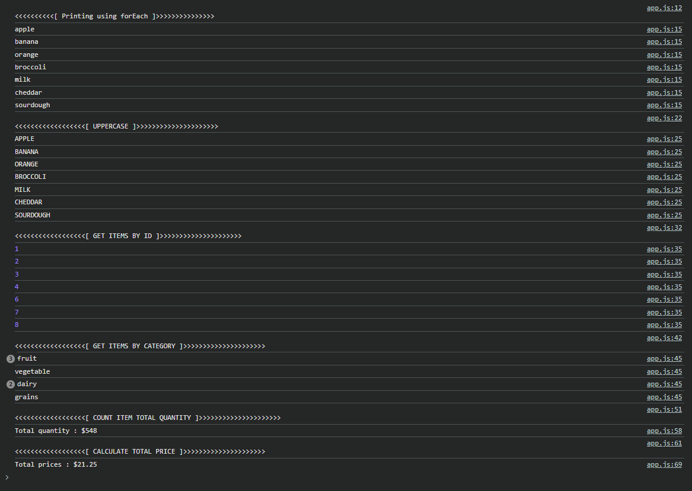

# Grocery List Workshop

## Overview
manipulate an array of grocery items. 

using array methods such as `find()`, `map()`, `reduce()`, and more.

## app
- Uses array methods to manipulate and retrieve data from a grocery list.

## OUTPUT

